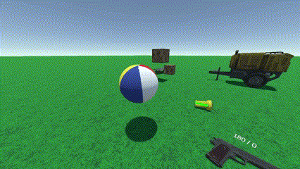
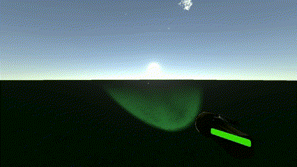

# Unity Kepler Assets

Multiple assets for Unity3D.

## Table of Contents
- [Object Control](#object-control)
- [First Person Controller](#first-person-controller)
- [Gun System](#gun-system)
- [Day Night Cycle](#day-night-cycle)

### Object Control
Easily manage object interactions with intuitive controls:

- `Left click` to pick up objects.
- `Right click` to throw with intertia.
- Zoom in and out using the `mouse wheel`.
- Rotate objects by pressing and scrolling the `mouse wheel`.
- `Ctrl + mouse wheel` to cycle through picked up objects.
<br>




```csharp
public float maxTakeDistance = 5f;
private float maxSaveDistance = 0.4f;
private float scrollSpeed = 0.25f;
private float rotationSpeed = 5f;
private float mouseSpeed = 0.05f;
private float moveSpeed = 0.1f;
public float throwForce = 400f;
```

[MousePickUp.cs](Assets/Scripts/MousePickUp.cs)

### First Person Controller
First-person controller with basic movement and camera controls:

- `WASD` to move
- `Space` to jump
- `Left Shift` to run
- `C` to crouch
- `V` to zoom in

Some of the variables you can adjust:
```csharp
public float walkingSpeed = 8f;
public float runningSpeed = 12f;
public float jumpSpeed = 10f;
public float zoomFOV = 50;
```

[FPSController.cs](Assets/Scripts/FPSController.cs) and [MouseLook.cs](Assets/Scripts/MouseLook.cs)

### Inventory System
Manage your in-game items efficiently:

- Press `E` to save object.
- Drop object by pressing `G`.
- Scroll the `mouse wheel` to cycle through your inventory.
<br>


### Gun System
- `Left click` to shoot
- `Right click` to aim
- Press `R` to reload
- Press `G` to drop weapon

Some of the variables you can adjust:
```csharp
public float damage;
public int magazineSize;
public bool automatic;
public float firerate, reloadTime;
public GameObject bullet, casing, muzzleFlash;
public Transform bulletExit, casingExit;
public TMP_Text ammoText;
public AudioClip shootSound, reloadSound, emptySound;
public float destroyTimer = 5f;
public float shotPower;
private float ejectPower = 40f;
```
[Gun.cs](Assets/Scripts/Gun.cs)

### Day Night Cycle
Create a captivating atmosphere with a dynamic day-night cycle:

- Adjust the day/night time speed to your preference.
<br>



```csharp
public float daytime = 0.5f;
public float timeMultiplier = 1f;
public float maxIntensity = 1f;
public Gradient cloudsColor;
```
[DayNightCycle.cs](Assets/Scripts/DayNightCycle.cs)
